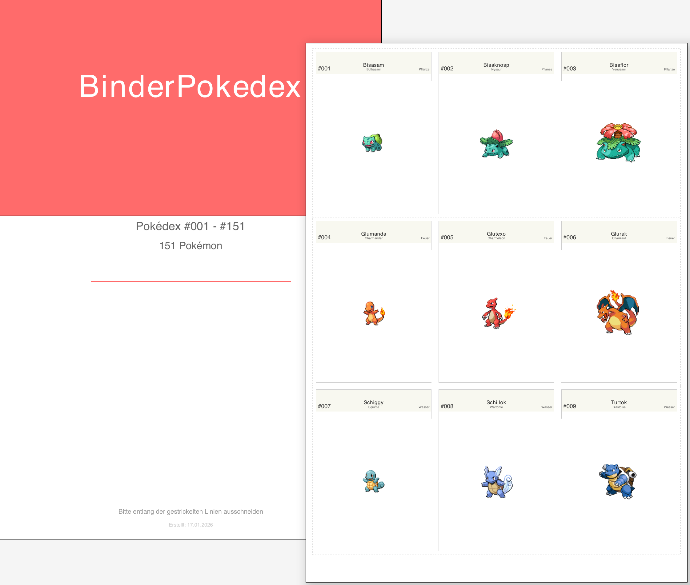

# 🎴 BinderPokedex

**Vervollständige dein Pokédex... ein druckbares Blatt nach dem anderen!** 📋✨

Drucke 1.025+ Pokémon über 9 Generationen in 9 Sprachen. Alle Varianten, alle Formen, alles startklar. Einfach laden, drucken und sammeln starten.

[](LICENSE)
[](https://www.python.org/)


---

## 🎨 Vorschau



---

## ✨ Hauptfeatures

- **9 Sprachen** 🌍 mit vollständiger CJK-Unterstützung (Japanisch, Koreanisch, Chinesisch)
- **1.025+ Pokémon** über alle 9 Generationen (Kanto → Paldea) im National Pokédex
- **Offizielle Artwork** von PokéAPI und TCGdex - authentische Bilder aus Spielen und TCG
- **3×3 Kartenlayout** (9 pro Seite) - perfekt für Standard-Binderblätter
- **Generations- und Varianten-Cover** mit wunderschönem mehrsprachigem Design und lokalisierten Logos
- **Komplette TCG-Unterstützung** 🎴
  - **3 EX-Generationen:** ExGen1 (2003-2007), ExGen2 (2012-2016), ExGen3 (2023+)
  - **21 Moderne Sets:** Komplette Karmesin & Purpur-Ära (SV01-SV10 + Spezial-Sets)
  - **Paldea-Ära:** ME01, ME02, ME02.5, MEP
  - Auto-Discovery und Batch-Generierung
- **Scope-basiertes System** mit 25 Scopes insgesamt
- **Strukturierte PDFs** mit thematischen Trennern und Featured-Pokémon-Headern
- **Modulare Pipeline** zum Daten-Fetching mit flexibler Konfiguration
- **Druckfertig A4** - einfach laden, drucken und binden! 📎

---

## 📥 Fertige PDFs Herunterladen

### Für normale Nutzer - einfach laden & drucken!


**Aktuelle Version (v8.1.1):** [Alle 225 PDFs](https://github.com/DerFlash/BinderPokedex/releases/tag/v8.1.1) ✨ *Neu: SVG-Templates, vollständiger CJK-Fix, lokalisierte TCG-Energietypen!*

**Nach Sprache (v8.1.1):** 🇩🇪 [DE](https://github.com/DerFlash/BinderPokedex/releases/download/v8.1.1/binder-pokedex-de.zip) | 🇬🇧 [EN](https://github.com/DerFlash/BinderPokedex/releases/download/v8.1.1/binder-pokedex-en.zip) | 🇫🇷 [FR](https://github.com/DerFlash/BinderPokedex/releases/download/v8.1.1/binder-pokedex-fr.zip) | 🇪🇸 [ES](https://github.com/DerFlash/BinderPokedex/releases/download/v8.1.1/binder-pokedex-es.zip) | 🇮🇹 [IT](https://github.com/DerFlash/BinderPokedex/releases/download/v8.1.1/binder-pokedex-it.zip) | 🇯🇵 [JA](https://github.com/DerFlash/BinderPokedex/releases/download/v8.1.1/binder-pokedex-ja.zip) | 🇰🇷 [KO](https://github.com/DerFlash/BinderPokedex/releases/download/v8.1.1/binder-pokedex-ko.zip) | 🇨🇳 [ZH](https://github.com/DerFlash/BinderPokedex/releases/download/v8.1.1/binder-pokedex-zh_hans.zip) | 🇹🇼 [ZH-T](https://github.com/DerFlash/BinderPokedex/releases/download/v8.1.1/binder-pokedex-zh_hant.zip)
---

## 📝 Was ist neu

### v8.1 (Juli 2026)

**CJK-Font-Fallback & TCG-Typübersetzungen** 🐛

🔧 **CJK-Fix (Koreanisch & Traditionelles Chinesisch):**
- Koreanische und traditionell-chinesische PDFs waren auf Linux/CI leer, da die macOS-exklusiven Fonts `AppleGothic` und `STHeitiMedium` fehlten
- `FontManager` fällt nun automatisch auf WenQuanYi/Noto zurück — alle 9 Sprachen erzeugen vollständige PDFs

🌍 **TCG-Energietyp-Übersetzungen:**
- `Colorless`, `Darkness`, `Lightning` und `Metal` sind TCG-exklusive Bezeichnungen ohne PokéAPI-Äquivalent — wurden bislang immer auf Englisch angezeigt
- Jetzt vollständig in allen 9 Sprachen übersetzt (z. B. `Darkness` → `Unlicht` / `あく` / `Ténèbres`)

### v8.0 (Juli 2026)

**SVG WYSIWYG Template-System & MEP-Erweiterung** ✨

🎨 **SVG-Template-System:**
- Vollständige SVG-basierte Karten-, Seiten- und Cover-Templates — live bearbeitbar in jedem SVG-Editor
- Templates unterstützen eingebettete Logos und automatische Bildplatzierung
- Neue CLI-Parameter: `--card-template`, `--page-template`, `--cover-template`, `--list-templates`
- Rückwärtskompatibel: bestehende Renders bleiben unverändert ohne Template-Flags

📦 **MEP Bulbapedia-Ergänzung:**
- MEP-Set von 10 auf 55 Karten erweitert via Bulbapedia-Daten
- Enthält alle Karten, die bei TCGdex fehlen

🔧 **Technisch:**
- CI: Upgrade auf Python 3.12 + pip-Caching für schnellere Builds
- PNG-Transparenz in Image-Cache und allen generierten PDFs erhalten
- TCG-mehrsprachige Kartenbezeichnungen korrigiert

📄 **[Vollständige Release Notes & Changelog](CHANGELOG.md)**

---

## 📚 Dokumentation

| Thema | Link |
|-------|------|
| **Verwendung & Beispiele** | [docs/USAGE.de.md](docs/USAGE.de.md) |
| **Features & Technik** | [docs/FEATURES.md](docs/FEATURES.md) |
| **Installationsanleitung** | [docs/INSTALLATION.md](docs/INSTALLATION.md) |
| **Druckanleitungen** | [docs/PRINTING_GUIDE.de.md](docs/PRINTING_GUIDE.de.md) |
| **Architektur** | [docs/ARCHITECTURE.md](docs/ARCHITECTURE.md) |
| **Data Fetcher** | [docs/DATA_FETCHER.md](docs/DATA_FETCHER.md) |
| **Image Cache** | [docs/IMAGE_CACHE.md](docs/IMAGE_CACHE.md) |
| **Mitwirken** | [docs/CONTRIBUTING.md](docs/CONTRIBUTING.md) |

---

## � Für Entwickler

### PDFs selbst generieren

```bash
# Clone & Setup
git clone https://github.com/DerFlash/BinderPokedex.git
cd BinderPokedex
python3 -m venv .venv && source .venv/bin/activate
pip install -r requirements.txt

# Verfügbare Scopes anzeigen (25 gesamt: 1 Pokedex + 3 ExGen + 21 TCG Sets)
ls config/scopes/*.yaml

# Daten für einen Scope holen
python scripts/fetcher/fetch.py --scope Pokedex

# PDF für eine bestimmte Sprache und Scope generieren
python scripts/pdf/generate_pdf.py --language de --scope Pokedex

# Alle Sprachen für einen Scope generieren
python scripts/pdf/generate_pdf.py --scope ME01

# Alle Scopes in allen Sprachen generieren
python scripts/pdf/generate_pdf.py --scope all
```

---

## ⚖️ Rechtlicher Hinweis

**Dies ist ein Fan-Projekt ohne kommerzielle Absichten.** Pokémon, Pokédex und alle zugehörigen Marken sind Eigentum von The Pokémon Company, Nintendo und GameFreak.

✅ **Erlaubt:** Persönliche Nutzung, Bildungszwecke, private Sammlungen  
❌ **Verboten:** Kommerzielle Nutzung, Verkauf von PDFs oder gedruckten Materialien, gewinnorientierte Weiterverbreitung

Vollständige Details siehe [LICENSE](LICENSE).

---

## �🙏 Danksagung & Quellen

Dieses Projekt verdankt seinen Erfolg diesen fantastischen Ressourcen und Personen:

- **[PokéAPI](https://pokeapi.co/)** 📊 - Das Rückgrat unseres Pokémon-Wissens
- **[Bulbapedia](https://bulbapedia.bulbagarden.net/)** 📚 - Das Pokémon-Fan-Wiki, das uns nie im Stich lässt
- **[The Pokémon Company](https://www.pokemon.com/)** 🎮 - Für 30 Jahre Traum-Erfüllung
- **ReportLab** 🎨 - Für die Umwandlung von Daten in wunderschöne PDFs ohne Stress
- **Python Community** 🐍 - Für das großartige Ökosystem und endlose Unterstützung
- **GitHub Copilot** 🦆 - Für Rubber-Ducking und dafür, dass er meine Gedanken manchmal vor mir kennt 😄
