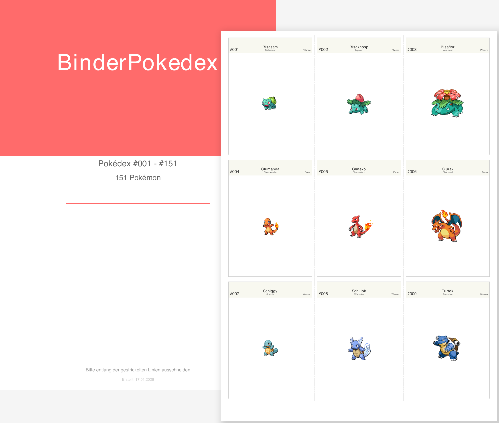

# 🎴 BinderPokedex

**Complete your Pokédex... one printable sheet at a time!** 📋✨

Print 1,025+ Pokémon across 9 generations in 9 languages. All variants, all forms, all ready to go. Just download, print, and start collecting.

[](LICENSE)
[](https://www.python.org/)


---

## 🎨 Preview



---

## 📥 Download Ready-Made PDFs

### For End Users - Just Download & Print!


**Latest (v6.0):** [All 117 PDFs](https://github.com/DerFlash/BinderPokedex/releases/tag/v6.0) ✨ *Major: Image cache redesign, multilingual form suffix support, comprehensive documentation*

**By Language (v6.0):**
🇩🇪 [Deutsch](https://github.com/DerFlash/BinderPokedex/releases/download/v6.0/binder-pokedex-de.zip) |
🇬🇧 [English](https://github.com/DerFlash/BinderPokedex/releases/download/v6.0/binder-pokedex-en.zip) |
🇫🇷 [Français](https://github.com/DerFlash/BinderPokedex/releases/download/v6.0/binder-pokedex-fr.zip) |
🇪🇸 [Español](https://github.com/DerFlash/BinderPokedex/releases/download/v6.0/binder-pokedex-es.zip) |
🇮🇹 [Italiano](https://github.com/DerFlash/BinderPokedex/releases/download/v6.0/binder-pokedex-it.zip) |
🇯🇵 [日本語](https://github.com/DerFlash/BinderPokedex/releases/download/v6.0/binder-pokedex-ja.zip) |
🇰🇷 [한국어](https://github.com/DerFlash/BinderPokedex/releases/download/v6.0/binder-pokedex-ko.zip) |
🇨🇳 [简体中文](https://github.com/DerFlash/BinderPokedex/releases/download/v6.0/binder-pokedex-zh_hans.zip) |
🇹🇼 [繁體中文](https://github.com/DerFlash/BinderPokedex/releases/download/v6.0/binder-pokedex-zh_hant.zip)
---

## 📝 What's New in v6.0

**Major Release - Architecture & Pipeline Redesign** (January 2026)

Complete data fetcher redesign with modular pipeline, image cache overhaul preventing form variant collisions, and multilingual form suffix preservation (X/Y/Primal) across all 9 languages.

📄 **[Full Release Notes & Changelog](CHANGELOG.md)**

---

## ✨ Key Features

- **9 Languages** 🌍 with proper CJK support (Japanese, Korean, Chinese)
- **1,025+ Pokémon** across all 9 generations (Kanto → Paldea) in National Pokédex
- **Official artwork** from PokéAPI and TCGdex - authentic images from games and TCG
- **3×3 card layout** (9 per page) - perfect for standard binder sheets
- **Generation & variant covers** with beautiful multilingual design and localized logos
- **TCG-EX Variant Collections** ✨ 
  - ExGen1: Classic ex cards from Ruby/Sapphire era (2003-2007)
  - ExGen2: Pokémon-EX from Black & White and XY series (2012-2016)
  - ExGen3: Modern ex cards from Scarlet & Violet (2023+)
- **Sectioned PDFs** with themed dividers and featured Pokémon headers
- **Modular pipeline** for data fetching with scope-based configuration
- **Print-ready A4** - just download, print, and bind! 📎

---

## 📚 Documentation

| Topic | Link |
|-------|------|
| **Usage & Examples** | [docs/USAGE.md](docs/USAGE.md) |
| **Features & Tech** | [docs/FEATURES.md](docs/FEATURES.md) |
| **Installation Guide** | [docs/INSTALLATION.md](docs/INSTALLATION.md) |
| **Printing Tips** | [docs/PRINTING_GUIDE.md](docs/PRINTING_GUIDE.md) |
| **Architecture** | [docs/ARCHITECTURE.md](docs/ARCHITECTURE.md) |
| **Data Fetcher** | [docs/DATA_FETCHER.md](docs/DATA_FETCHER.md) |
| **Image Cache** | [docs/IMAGE_CACHE.md](docs/IMAGE_CACHE.md) |
| **MCP Integration** | [docs/MCP_INTEGRATION.md](docs/MCP_INTEGRATION.md) |
| **Contribution** | [docs/CONTRIBUTING.md](docs/CONTRIBUTING.md) |
| **Pokémon Variants** | [docs/VARIANTS_FEATURE_SUMMARY.md](docs/VARIANTS_FEATURE_SUMMARY.md) |
| **Variants Architecture** | [docs/VARIANTS_ARCHITECTURE.md](docs/VARIANTS_ARCHITECTURE.md) |
| **Variants Quickstart** | [docs/VARIANTS_QUICKSTART.md](docs/VARIANTS_QUICKSTART.md) |

---

## 🚀 For Developers

### Generate Your Own PDFs

```bash
# Clone & setup
git clone https://github.com/DerFlash/BinderPokedex.git
cd BinderPokedex
python3 -m venv .venv && source .venv/bin/activate
pip install -r requirements.txt

# List available scopes
ls config/scopes/*.yaml

# Fetch data for a scope
python scripts/fetcher/fetch.py --scope Pokedex

# Generate PDFs
python scripts/pdf/generate_pdf.py --language de --scope Pokedex
```

---

## ⚖️ Legal Notice

**This is a fan-made, non-commercial project.** Pokémon, Pokédex, and all related trademarks are the property of The Pokémon Company, Nintendo, and GameFreak.

✅ **Permitted:** Personal use, educational purposes, private collections  
❌ **Prohibited:** Commercial use, selling PDFs or printed materials, profit-driven redistribution

For full details, see [LICENSE](LICENSE).

---


## 📄 License

MIT License - See [LICENSE](LICENSE) for details.

---

## 🙏 Credits & Acknowledgments

This project couldn't exist without these amazing resources and people:

- **[PokéAPI](https://pokeapi.co/)** 📊 - The backbone of our Pokémon knowledge
- **[Bulbapedia](https://bulbapedia.bulbagarden.net/)** 📚 - The Pokémon fan wiki that never lets us down
- **[The Pokémon Company](https://www.pokemon.com/)** 🎮 - For keeping the dream alive for 30 years
- **ReportLab** 🎨 - For turning data into gorgeous PDFs without breaking a sweat
- **Python Community** 🐍 - For the incredible ecosystem and endless support
- **GitHub Copilot** 🦆 - For rubber-ducking and occasionally knowing what I want before I do 😄
