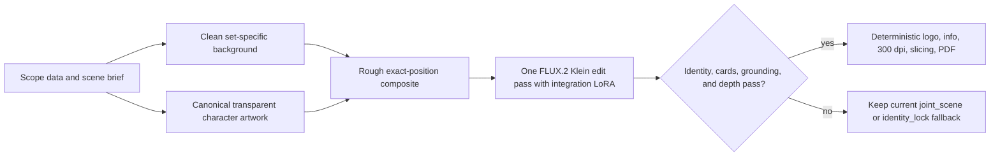

# Poster Artwork Integration LoRA

This document fixes the decision, data contract, training phases, and stop
rules for the optional poster-integration experiment. It does not change the
production renderer. The reviewed FLUX.2 `joint_scene` workflow remains the
default and `identity_lock` remains the exact-source fallback until an unseen
holdout proves that a trained adapter is better than both.

## Decision

Train one task-specific paired edit LoRA for FLUX.2 Klein 4B:

> Transform a rough poster composite into one coherent illustrated scene while
> preserving every supplied character's exact count, assigned card, position,
> scale, pose, silhouette, anatomy, face, colors, and markings. Change only the
> surrounding terrain, lighting, contact shadows, and physically consistent
> foreground/background occlusion.

This is deliberately not a Pokemon style LoRA, not one LoRA per Pokemon, and
not a full model fine-tune. A domain LoRA can make a plausible Pokemon-like
redesign more likely without solving placement or depth. Per-character LoRAs
do not scale and can interfere when three are active. A full fine-tune adds
cost and forgetting risk before paired edit data has proved the task learnable.

The deterministic copy-based result by itself is an **input**, never a target.
A target must already pass the identity, layout, grounding, and depth gates.
Training on an almost-correct target would teach the known error as desired
behavior.

## Architecture boundary



The training experiment remains outside fetch, PDF, CI, and normal promotion.
Those paths never install a trainer, download a base model, or start a GPU job.

## Immutable image-pair contract

| Property | Contract |
| --- | --- |
| Target directory | `target/`; this is AI Toolkit `folder_path` |
| Control directory | `reference/`; this is `control_path_1` |
| Pair binding | Identical filename stem in both directories |
| Caption location | UTF-8 `.txt` beside the target image |
| Raw dimensions | 848 x 1168 for `standard_3x3` v1 |
| Geometry | Width and height divisible by 16; no crop, flip, or rotation |
| Content | Text-free pre-overlay artwork only |
| Output resolution | Never use the later 2368 x 3268 300-dpi raster as training data |
| Subjects | Two to four; v1 concentrates on the normal three-subject 3x3 case |
| Pair review | Human review is mandatory; automatic checks can reject but not approve |

Inputs may have hard edges, weak shadows, or an obvious copied appearance. The
target must keep the same composition and must not arbitrarily replace the
whole background. Local or global reinterpretation is acceptable only where
it produces one coherent scene without moving or redesigning a subject.

### Aligned teacher-target recipe

The first bounded target recipe uses the complete rough composite as the only
FLUX.2 reference. The untrained model may reinterpret the environment, light,
ground contact, and shadows, but its repainted character pixels are not trusted
as target truth. The canonical positioned RGBA subjects are alpha-composited
back over that teacher scene at their original pixels:

```bash
python -m scripts.poster_assets.training_dataset compose-target \
  --edited-scene tmp/poster-training/v0/scene-edit.png \
  --source-reference data/poster_assets/SCOPE/comfyui_poster/inpaint_reference.png \
  --output tmp/poster-training/v0/aligned-target.png
```

This restoration is a dataset-construction step, not a production renderer.
It gives the LoRA aligned examples of the desired operation: retain the input
subjects while learning the teacher's revised terrain and contact shadows.
`compose-target` refuses overwrite, requires matching dimensions and an RGBA
source, and fails unless every fully opaque source pixel is exact afterward.
The result remains `candidate_pair_review`; a human must reject halos, duplicate
limbs outside the restored mask, inconsistent shadows, broken depth, or a
globally replaced composition before marking it `gold`.

The exact-source audit is an anatomy and registration gate, not a depth gate.
A target with every source pixel intact is still invalid when a foreground
plant or blade is drawn behind the restored subject. Such a pair would teach
the wrong occlusion order directly and is rejected before materialization.

This recipe can directly create only clean-avoidance or behind-subject targets.
It must not be used when an element rooted in the foreground should cover the
subject: restoring the exact RGBA subject would reverse that depth order. Such
samples require a separately reviewed foreground layer or another explicit
depth-control method and are excluded from the plumbing overfit.

For occlusion, the data must include all three valid outcomes:

1. landscape elements avoid the subject;
2. one connected element stays continuously in front;
3. one connected element stays continuously behind.

A leaf or grass blade that changes depth or ends at a silhouette is never a
gold target. Visible foreground crossing is optional; clean avoidance is a
valid result.

## Dataset plan

The fourteen promoted posters are seed material, not fourteen automatic gold
pairs. The initial audit resolves their raw reviewed targets and searches the
local scratch area for historical `identity_lock` inputs. Historical artifacts
must match the **current** exact-source placement and pixels before they can be
used. A visual resemblance is not sufficient.

Pilot target:

- 30-40 genuinely different gold scenes;
- 60-80 aligned pairs after limited input-only variants;
- at least half the scenes with clean separation, plus reviewed front, behind,
  and mixed depth examples;
- different body shapes, fine appendages, lighting, and environments;
- all variants of one scene kept in the same split.

Version 1 target, only after the pilot succeeds:

- 60-100 unique scenes;
- 80-150 total pairs;
- approximately 70-75% train, 10-15% validation, and 15-20% holdout;
- complete species and scopes held out, rather than random files from a known
  scene.

Fixed hard fixtures include Base1/Generation I, Generation VII, ExGen2 Normal,
ExGen2 Mega, and ExGen2 Primal. ExGen2 Normal is excluded as a training target
while its Mew and Mewtwo hand anatomy remains below the exact gold contract.

Every pair manifest records the scope, subject IDs, split, source and target
hashes, target provenance, image dimensions, source-pixel audit, occlusion
class, teacher model/seed when known, reviewer, and all hard-gate decisions.
Images stay in ignored local storage; scripts, configuration, decisions, and
hashes are versioned.

## Captions

Captions describe the edit operation, not Pokemon names. Five short equivalent
instructions are rotated deterministically. Species names are omitted so that
success on an unseen identity proves reference use instead of memorization.
The exact variants live in
`config/poster_training/flux2_klein_integration_v1.json`.

## Training phases

### 0. Audit without training

```bash
python -m scripts.poster_assets.training_dataset audit \
  --config config/poster_training/flux2_klein_integration_v1.json \
  --output tmp/poster-training/v0/audit.json

python -m scripts.poster_assets.training_dataset validate \
  --manifest tmp/poster-training/v0/audit.json
```

`candidate_pair_review` is not approval. `needs_fresh_exact_input` means the
historical copy-based image cannot satisfy the current source-pixel contract
and must be rendered or rebuilt again before human pair review.

### 1. Plumbing overfit

Only after 4-8 aligned pairs are marked `gold`, materialize an immutable dataset:

```bash
python -m scripts.poster_assets.training_dataset materialize \
  --manifest tmp/poster-training/v0/audit.json \
  --output tmp/poster-training/v0/overfit-dataset
```

Run 100-300 steps. The tiny set must visibly learn rough-composite to integrated
scene. Failure here means target/control direction, pairing, model support, or
configuration is wrong; do not compensate with a longer job.

### 2. 4B pilot

Train `black-forest-labs/FLUX.2-klein-base-4B`, LoRA only, without text-encoder
training. Baseline settings are rank/alpha 32/32 for linear layers, 16/16 for
convolutional layers, BF16, batch 1, gradient accumulation 2, flowmatch with
weighted/balanced timesteps, and learning rate `1e-4`. Save every 250 steps and
visually compare 750, 1000, 1250, 1500, and 1750. Stop by 2000 unless new
evidence justifies more. If validation oscillates or identity degrades, make
one isolated `5e-5` retry.

Use `match_target_res: true`. Keep `flip_x`, `flip_y`, random crops, and text
encoder training disabled. Masked loss and a 9B model are later isolated
experiments, not baseline complexity.

AI Toolkit must be pinned to an exact commit after its 4-8-pair preflight. In
its edit dataset configuration, `folder_path` is the target and
`control_path_1` is the rough input. Reversing these paths trains the opposite
operation.

### 3. Holdout comparison

Render the same fixtures in three columns:

1. current `joint_scene` default;
2. current `identity_lock` fallback;
3. edit LoRA at a small fixed strength sweep, initially 0.7, 0.9, and 1.0.

No checkpoint is promoted by loss or a lucky seed. Review the raw poster and
every physical card crop. Automatic similarity, silhouette, and bounds checks
may reject a candidate, but anatomy and depth approval remains human.

### 4. Optional escalation

Only if the 4B pilot shows the correct edit behavior but lacks capacity may the
same frozen dataset be tried with 9B. If integration improves while identity
still drifts, evaluate one verified identity/detail-control or masked-loss
variant. Do not start a broad model/rank/optimizer matrix.

## Promotion and stop rule

The adapter may become a selectable experimental renderer only when unseen
fixtures have:

- exact subject count and assigned-card containment in every case;
- no gross identity, form, face, anatomy, or marking failure;
- identity no worse than the current `joint_scene` output;
- materially better scene integration than `identity_lock`;
- coherent contact, shadows, and either avoided or continuous occlusion;
- untouched title and information safe areas and no generated text.

If no checkpoint beats both retained paths on at least four of the five hard
fixtures, make at most one isolated data/configuration correction and stop. A
simple LoRA still redraws pixels and therefore cannot guarantee exact identity.
If the two goals remain incompatible, retain the fallbacks and evaluate a
stronger identity/detail controller rather than accumulating prompt and graph
complexity.

## Tool and hardware boundary

The first Apple-Silicon run is a native macOS/MPS smoke test in BF16; FP8 is
not the training baseline. Ordinary Docker Desktop on macOS does not expose
Metal to the Linux guest, so a container may package control-plane files but
not replace the native MPS trainer. Record the AI Toolkit commit, Python,
PyTorch, macOS version, device, config hash, model revision, and every output
checkpoint hash.

## Sources

- [BFL FLUX.2 Klein LoRA training guide](https://huggingface.co/blog/black-forest-labs/flux-2-klein-lora)
- [BFL FLUX.2 Klein training example](https://docs.bfl.ai/flux_2/flux2_klein_training_example)
- [FLUX.2 Klein Base 4B model card](https://huggingface.co/black-forest-labs/FLUX.2-klein-base-4B)
- [Ostris AI Toolkit](https://github.com/ostris/ai-toolkit)
- [AnyDoor](https://openaccess.thecvf.com/content/CVPR2024/html/Chen_AnyDoor_Zero-shot_Object-level_Image_Customization_CVPR_2024_paper.html)
- [IMPRINT](https://arxiv.org/abs/2403.10701)
- [ObjectStitch](https://arxiv.org/abs/2212.00932)
